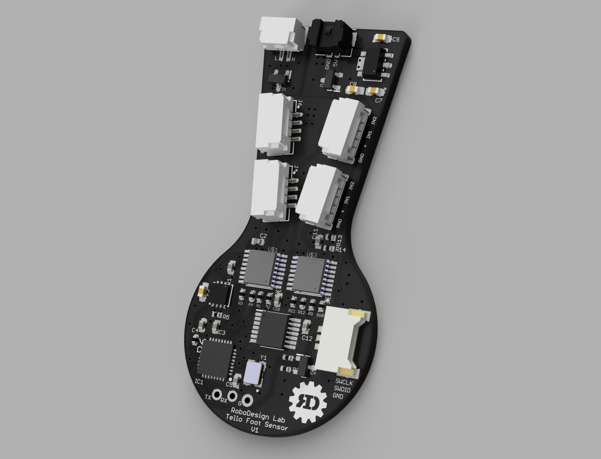
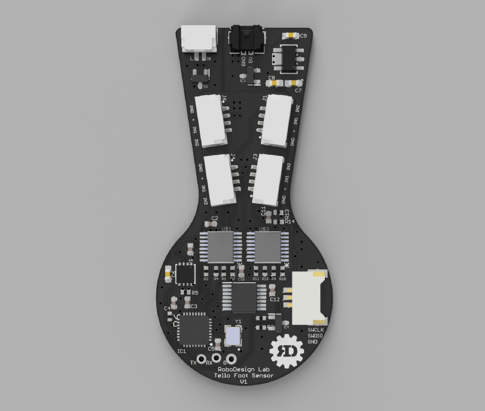
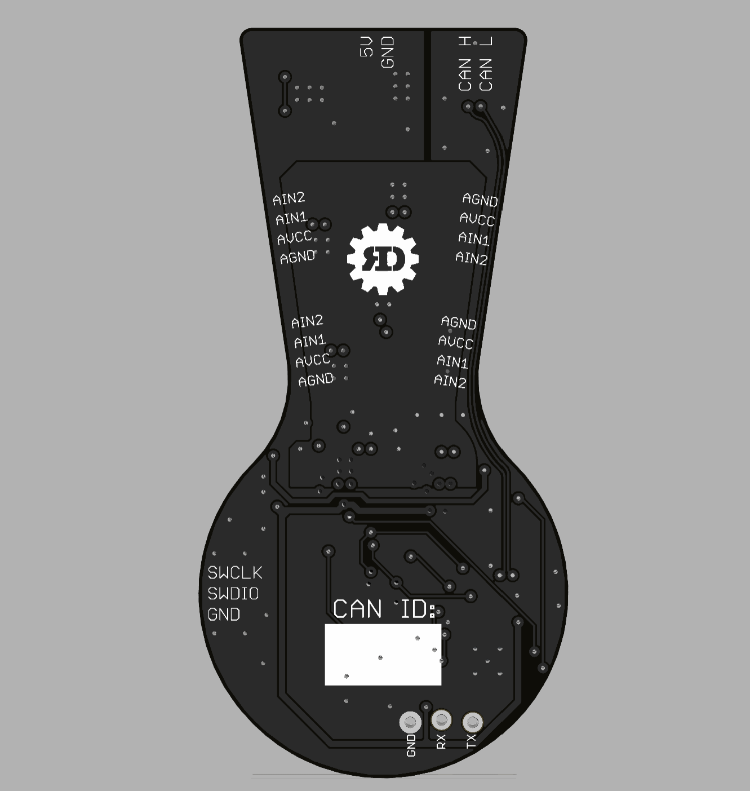
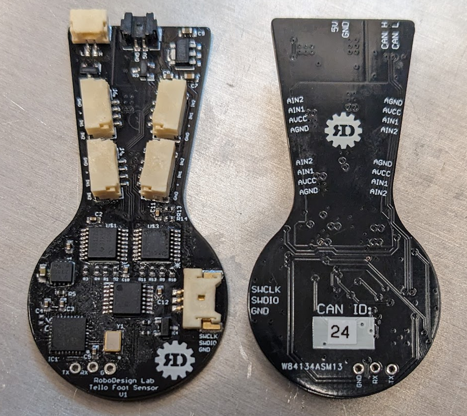
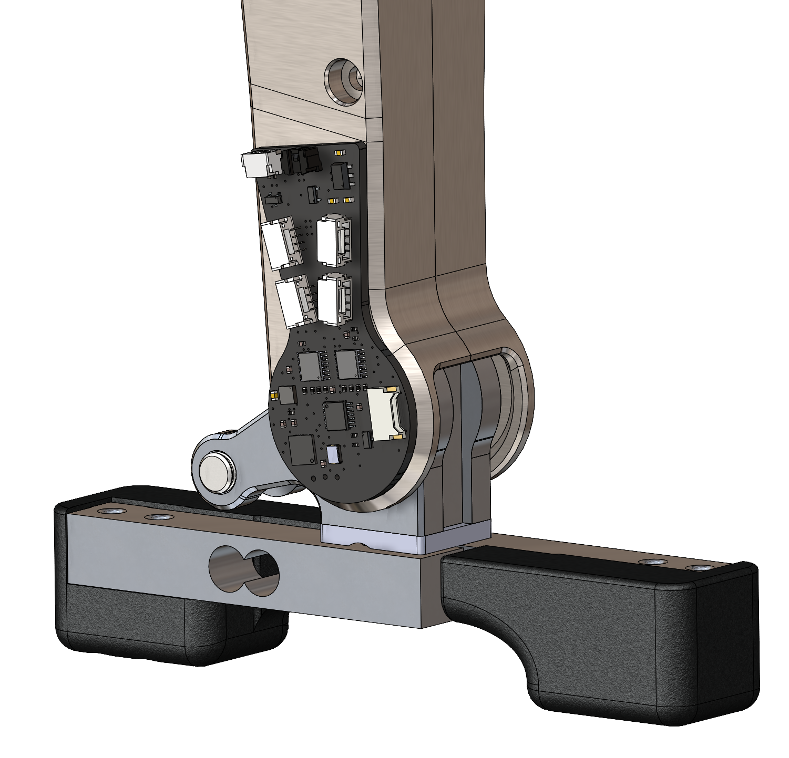

# Tello Foot Sensor
Design Files and Firmware for an Ankle Encoder + Loadcell Amplifier Combo PCB for Tello Bipedal Robot

- STM32G4 Collects sensor data and streams over CAN-FD
- Position and velocity of the AS5147U encoder is read and streamed at 1KHz
- Two loadcells are read through two ADS1220 amplifiers and streamed at 1KHz
  - Optionally, four loadcells can be connected and streamed at ~700Hz

  

  

  

  

  

